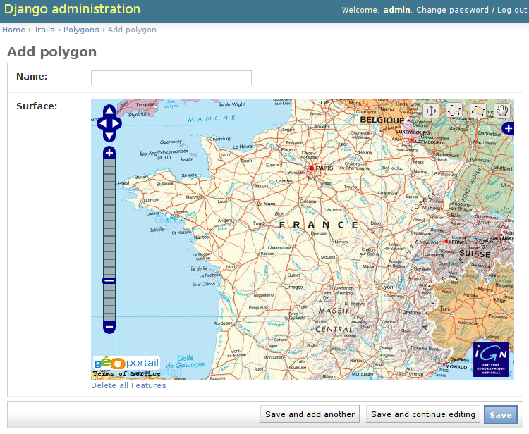
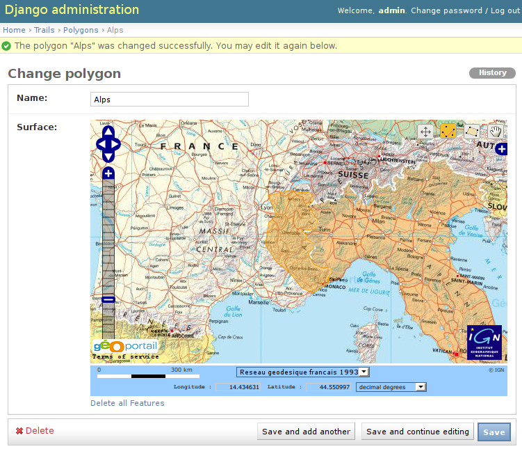

Admin integration
=================

Of course, *django-geoportail* couldn't ship without any Django admin support.
We will see how you can easily use Geoportal's data within the Django admin.

Registration of a model
-----------------------

You have started a project and a few apps in this project. Now you need a
model that contains some geographic data.

Definition of the model
```````````````````````

There is nothing more than GeoDjango, you just need to define a Django model
with one or more geographic field and stick a GeoManager to it:

.. code-block:: python

    # models.py
    from django.contrib.gis.db import models

    class Polygon(models.Model):
        name = models.CharField('Name', max_length=255)
        surface = models.PolygonField()

        objects = models.GeoManager()

        def __unicode__(self):
            return u'%s' % self.name

Registration of the model
`````````````````````````

Now, we need to register the model within the admin interface, so we can add
instances of this model to the database using rich map widgets. This can be
done very easily in the ``admin.py`` file:

.. code-block:: python

    # admin.py
    from geoportal import admin
    from app.models import Polygon

    admin.site.register(Polygon, admin.GeoPortalAdmin)

And you're done! Start your development server, go to your admin interface and
see the map that pops up when you want to add an object:



The map is centered on France since this is where we have the most detailed
information and the highest resolution. However, some layers are available in
the entire world.

Customization of the map
------------------------

How cool was that? We have access to zoomable, high-quality maps in a few
lines of python code!

.. _admin-example:

Example
```````

Let's do some customisation. As you would have guessed, the customization is
simply done by subclassing the base admin class provided by
*django-geoportail*. Here is a simple example

.. code-block:: python

    # admin.py
    from geoportal import admin
    from app.models import Polygon

    class PolygonAdmin(admin.GeoPortalAdmin):
         map_info = True
         layers = (
             ('maps', 1),
         )

    admin.site.register(Polygon, PolygonAdmin)

We have overriden a few options here. ``map_info`` is a boolean indicating
whether to show the 50px-high blue bar below the map. The ``layers`` tuple
defines which *layers* we want to display, this will be fully explained later.
(athough in this case, the value is the default one). Here is what our admin
interface looks like now:



Here I have added a polygon that covers all the French part of the Alps. We
will see it again later. Note the blue bar at the bottom of the map.

.. _admin-ref:

Admin options reference
```````````````````````

Here is a full list of the currently supported admin options that you can use
to customize your admin widgets.


* ``map_width``: the width of the map (in pixels). Default: ``600``

* ``map_height``: the height of the map, in pixels. Default: ``400``

* ``default_zoom``: the zoom level when a new empty map is created. Default:
  ``5``

* ``default_lon``: default longitude for a new map. Default: ``2``

* ``default_lat``: default latitude for a new map. Default: ``47``.
  ``default_lon``, ``default_lat`` and ``default_zoom`` are set to display a
  map centered on France with the whole country. They can be easily overriden
  to focus a map to a specific town or area.

* ``point_zoom``: the zoom level to select when you see a single point.
  Default: ``14``, for a 1:25000 map (best resolution available)

* ``map_info``: show Geoportal's scale and coordinates widget. Default:
  ``False``

* ``layers``: A 2-tuple tuple to customize the layers. Default:
  ``( ('maps', 1), )``. The format is ``( ('code', opacity), (..., ...), )``.
  ``code`` is the codename of the layer you want to display, ``opacity`` is
  its opacity, between 0 and 1.

  The order is important, the layers are added to the map in the same order
  as they are defined. If you add a layer with an opacity set to 1 to some
  previously added layers, this will hide the previous layers.

  Available layers are:

  * ``'photos'``
  * ``'maps'``
  * ``'terrain'``: elevation map
  * ``'cadaster'``: cadastral parcels
  * ``'hydrography'``
  * ``'roads'``
  * ``'railways'``
  * ``'runways'``
  * ``'buildings'``
  * ``'gov'``: utility and governmental services
  * ``'boundaries'``: adminstrative boundaries
  * ``'coast'``: sea regions

  Note that layers may or may not be available depending on your API key.
  The free contract gives you only ``'photos'`` and ``'maps'``.

  For more information about the different layers, please read the `IGN
  documentation on available layers`_

  .. _IGN documentation on available layers: https://api.ign.fr/geoportail/api/doc/fr/webmaster/layers.html

  As an example, if you want a slighlty-transparent layer of aerial photos
  over a map, you can write:

  .. code-block:: python

      layers = (
          ('maps', 1),
          ('photos', 0.3),
      )

* ``layerswitcher``: Display the menu to toggle each layer's visibility.
  Default: ``True``.

