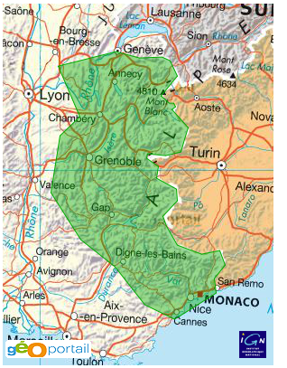

Welcome to Django-geoportail's documentation!
=============================================

`Géoportail`_ is a web portal managed by the French National Geographic
Institute. They provide high-resolution maps and aerial photos of French
territories, as well as several sets of geolocalized data.

.. _Géoportail: http://www.geoportail.fr/

They also provide a `javascript API`_ based on `OpenLayers`_, which can be
used by web developers to add geographic data to external websites and
Geographic Information Systems.

.. _javascript API: https://api.ign.fr/
.. _OpenLayers: http://openlayers.org/

**Django-geoportail** is a `Django`_ app that abstracts the javascript API and
makes it easier to display Geportail's data on your Django site. It is
built on top of `GeoDjango`_.

.. _Django: http://www.djangoproject.com/
.. _GeoDjango: http://geodjango.org/

This documentation is available online on `packages.python.org`_. It covers
all steps to plug Geoportal's data to your site:

.. _packages.python.org: http://packages.python.org/django-geoportail/

.. toctree::
   :maxdepth: 3

   installation
   admin
   templates
   forms
   settings

.. warning:: Contributions are welcome!

   If you experience problems using *django-geoportail*, I'd like to hear from
   you! Please `file bugs on bitbucket`_, ask questions on how to use
   *django-geoportail*, and more importantly **ask for new features**! You
   don't *have* to write patches, but ideas and improvements are more than
   welcome.

   .. _file bugs on bitbucket: http://bitbucket.org/bruno/django-geoportail/issues/

.. note:: Licence

   *Django-geoportail* is released under the BSD licence.
