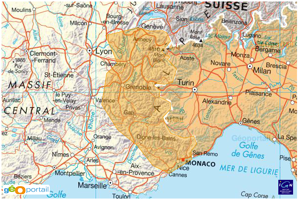

Template integration
====================

Adding Geoportal's maps to the templates
----------------------------------------

*Django-geoportail* provides a great template library that you can use to
display read-only maps in your templates (with or without drawn features).
There are two ways to enable this library:

* **On a project basis**: if you need *django-geoportail*'s tags in almost
  every template of your project, you can add in your project's
  ``__init__.py``:

  .. code-block:: python

      from django import template
      template.add_to_builtins('geoportal.templatetags.geoportal_tags')

* **On a per-template basis**: simply add this line on the top of the template
  where you need geoportal's template tags:

  .. code-block:: jinja

      

The  template tag
------------------------------------

Syntax:

.. code-block:: jinja

    

Basic usage
```````````

``geoportal_tags`` provides a single template tag: the ````
tag. It takes a required argument and several options.

The required argument is a geographic field. It can be a point, a linestring,
a polygon or even a set of polygons or any type of geographic field. The
simplest way to display a geographic field is (assuming you have a
``model_instance`` variable in your template context):

.. code-block:: jinja

    

When this template tag is called, *django-geoportail* renders all the
javascript code that is needed to display the field, and renders a map with
the default options. With the ``Polygon`` I draw in the :ref:`admin-example`
section, the map would look like this:



This is a map with the standard dimensions (600x400 pixels), the default
feature color (``#ee9900``) and the default feature opacity (``0.4``).

Getting the javascript context
``````````````````````````````

When a map is rendered on a template, a random javascript variable is
generated and this variable stores the map's information. If you need to do
some further customization, you can get this variable in your template
context:

.. code-block:: jinja

    

This will still render the map and you will be able to manipulate it with some
javascript code:

.. code-block:: html

    <script type="text/javascript">
        {{ var_name }}.viewer.setSize(...);

        {{ var_name }}.viewer.map.setCenter(...);
    </script>

Here is the detai of what ``{{ var_name }}`` contains:

* ``viewer`` a ``Geoportal.Viewer`` instance. You can see what it does on the
  `Geoportal API documentation`_. The ``viewer.map`` object (an
  ``OpenLayers.Map`` instance) is especially interesting to manipulate.

.. _Geoportal API documentation: https://api.ign.fr/geoportail/api/doc/1.0beta4/jsdoc/

* ``layers``: a list of the layers displayed on the map.

``{{ var_name }}`` also contains several function definitions and some
internal variables. Feel free to read the generated code and see what's
interesting.

The ``as var_name`` argument should always be the last argument. If you need
any option (see below), you should always specify them *before*.

Map options
-----------

Specifying options
``````````````````

We've seen a standard map but it has to be customized: the feature color is
too close to the color of Italy on the map. This is one of the things we can
change.

Several options are available. The syntax for all options is the following:
each options is a pair ``key=value``, and two pairs **must** be separated by a
comma. Some whitespace can be added since it often improves readability.

Here is an example of rendering a map with ``option1`` set to ``1`` and
``option2`` set to ``ff0000``:

.. code-block:: jinja

    

Option values can be static strings or template variables. If ``some_value``
is available in the template context, calling

.. code-block:: jinja

    

will resolve ``some_value`` from the template context. This can be very
useful when some parameters have to be dynamic.

.. note:: Boolean options

   Boolean values should be ``0`` (false) or ``1`` (true), nothing else.


Map options reference
`````````````````````

Here is a full list of the available options and their default values.

* ``width``: the width of the map, in pixels. Default: ``600`` or the
  overriden corresponding setting.

* ``height``: the height of the map, in pixels. Default: ``400`` or the
  overriden corresponding setting.

* ``visible``: boolean specifying the visibility of the feature on the map.
  Default is ``1`` (true), setting it to ``0`` will display the map centered
  on the feature but without any more layer.

* ``color``: the color of the feature, in ``rrggbb`` format. Default is
  ``ee9900`` or the overriden corresponding setting.

* ``opacity``: the opacity of the feature (mostly for polygons), float value
  between ``0`` (completely transparent) and ``1`` (no transparency). Default
  is ``0.4`` or the overriden corresponding setting.

* ``zoom``: the zoom level to set the map to. The default behaviour is to set
  the zoom level dynamically so the feature fits completely on the map (or
  just use ``settings.GEOPORTAL_POINT_ZOOM`` for points). However, if you need
  to force the zoom level this can be achieved easily.

* ``navigation``: boolean specifying whether the navigation should be enabled
  on the map. Navigation means panning and zooming in or out. The default
  behaviour is to disable the navigation, this can be changed by setting
  ``navigation`` to ``1``.

Final example
`````````````

Let's finish with an example:

.. code-block:: jinja

    

Here we generate a squared (300x300 pixels) map of a point. The point will be
red with a rather high opacity. The zoom level is forced to ``14`` in case it
is overriden in the settings.

The result is, as we can expect (oh, and the point has the coordinates of the
*Mont Blanc*):


